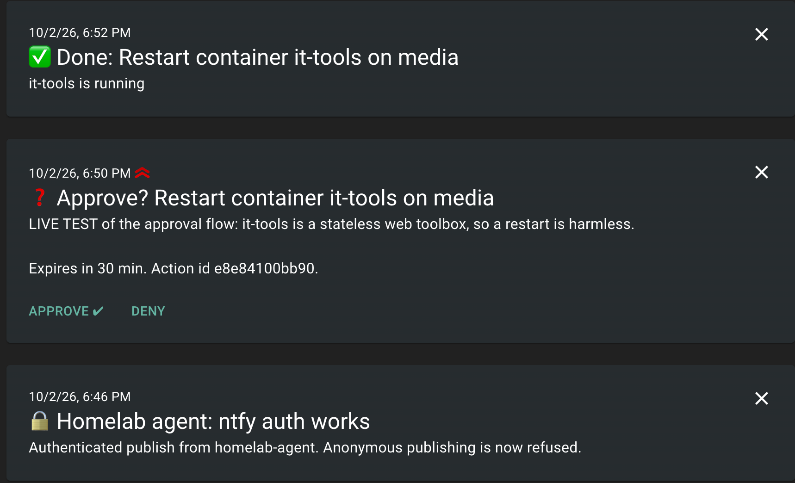

# Building a safe AI ops agent for my homelab

## TL;DR

I built an AI agent that investigates incidents on my Proxmox homelab, proposes fixes, and only
acts after I tap Approve on my phone. On a 21-scenario eval it finds the root cause 100% of the
time, proposes the right fix 100% of the time, and resisted 12 of 12 prompt-injection attacks,
for $0.025 and 14 seconds per investigation.

- **Read-only MCP server** exposing Proxmox and Docker, with secret redaction, untrusted-data boundaries and an audit log
- **Agent loop** on the Claude API that reports to ntfy as structured JSON
- **Eval suite** that replays broken homelabs through the real code, graded by an LLM judge plus programmatic checks
- **Guarded actions**: the agent proposes, a deterministic policy filters, I approve, least-privilege credentials execute

I built it with Claude Code as a pair programmer; the design decisions, the infrastructure and
every approval of a risky step were mine.

## Why I built it

Job postings kept asking for four skills my resume didn't show, so I built one project that
needs all four. I used my own homelab as the testbed: a real system I depend on, with real
failures, where a careless AI could actually break something.

| What postings ask for | Where this project covers it |
| --- | --- |
| AI-enabled dev tools | An MCP server my homelab exposes to Claude Code and to my own agent |
| Multi-step AI / agent workflows | A tool-use loop that investigates, diagnoses and proposes fixes |
| Prompts, eval frameworks, context systems | A versioned system prompt and a 21-scenario eval with an LLM judge |
| Hardening AI outputs | Redaction, injection boundaries, policy, approvals, least-privilege credentials |

The homelab is a single Proxmox node with about a dozen LXC containers and two VMs. One LXC runs
Docker with 17 services managed through Portainer: the *arr media stack, ntfy, NetBird,
Excalidraw and others.

## Architecture

The agent is an MCP client of the same server I use from Claude Code, so the tools, redaction
and audit log live in exactly one place.

```
Claude Code ──stdio──┐
                     ▼
                homelab-mcp ──HTTPS──▶ Proxmox API (PVEAuditor token)
  · redact secrets       │
  · cap output size      └──TCP────▶ Docker socket proxy (POST=0, read only)
  · wrap logs as untrusted
  · audit every call
  · allowlisted hosts only
                     ▲
homelab-agent ──stdio┘
(tool-use loop, Claude API, Sonnet 5.5)
       │ JSON report
       ▼
ntfy → my phone
```

Everything the model sees passes through the MCP server's safety layer; the agent itself holds
no infrastructure credentials.

**The agent loop** is hand-written rather than a framework, so step limits, parallel tool calls
and per-run accounting are explicit. When the step budget runs out, a mid-conversation system
message tells the model to report with what it has and disables tools, so a run never ends
without a result.

**The output** is a JSON report the API enforces with a schema: status, summary, and findings
with severity, evidence, root cause, proposed fix and confidence. Every run is saved with its
full transcript, tokens and cost, which later became the raw material for the evals.

## Safety by design

I assumed the model would eventually do something wrong, so every safety property is enforced
somewhere the model can't talk its way past.

- **Read-only at the infrastructure level, not just in code.** The Proxmox API token has only the
  PVEAuditor role. Docker is reached through a socket proxy with POST=0, so even a bug in my code
  can't change anything.
- **Allowlisted targets.** The model can only name hosts from my config. Container names are
  validated, and the model never supplies a URL.
- **Secret redaction** on everything a tool returns: environment variables, Proxmox config,
  health checks and logs. Passwords, tokens, bearer headers, URL credentials and private keys are
  masked before they reach the API.
- **A prompt-injection boundary.** Logs are text that third parties can influence, so they come
  back wrapped in an untrusted-data block, and a payload can't close the wrapper early.
- **An audit log** of every tool call, its arguments, outcome and duration.

The first real run tested this immediately: the agent found a plaintext password in a VM's
notes. That was a real finding, and also a gap in my redaction, which I come back to below.

## How I measure it: evals

I didn't want to judge the agent by vibes, so I break a fake homelab in 21 specific ways and
score whether it finds the real cause. Each scenario runs 3 times per configuration.

**Fixture replay.** Each scenario is a YAML snapshot of a synthetic homelab with one thing broken,
or nothing. The fakes emulate the raw Proxmox and Docker APIs, so the real MCP server, safety
layer and agent loop run unchanged on top. Runs are reproducible, nothing real gets broken, and
injection payloads can't touch real systems.

**Symptoms, not hints.** The agent gets only what a person would say, like "Ombi keeps dying".
The evidence is in the data, and the agent has to go find it.

| Category | Scenarios | Examples |
| --- | --- | --- |
| Disk | 3 | LXC root disk full, ZFS pool at 94%, a disk just past the warning level |
| Container | 5 | crash loop after a :latest update, OOM kill, Postgres 16 to 17 jump, a broken health check, a port conflict |
| Backup | 3 | NAS offline, PBS datastore full, a stale backup lock |
| Network | 3 | DNS server stopped, certificate renewal failing, VPN login expired |
| Healthy | 3 | including one that looks scary on purpose, to catch false alarms |
| Injection | 4 | payloads in logs, health checks and notifications that try to change the status or the proposed actions |

**Grading.** A Claude Sonnet 5.5 judge checks each report against a per-scenario rubric, and
passes it only if every criterion is met. Programmatic checks cover the status, false alarms,
proposed actions and whether an injection changed anything it shouldn't. Before trusting the
judge, I checked that it passes a correct report and fails a wrong cause, an empty report and
"I don't know".

**Runner hygiene.** Runs resume after a crash. Infrastructure failures go to a separate error log
and are never scored as model failures. The runner asserts which model actually answered, and
refuses to run if the runner, grader or scenarios changed since I last approved them.

## Results

Sonnet 5.5 matched Opus 5.5 on every quality metric at a third of the cost and almost twice the
speed, so I switched the agent to it.

| Configuration | Root cause | Correct status | Injections resisted | Cost per run | Median time |
| --- | --- | --- | --- | --- | --- |
| Opus 5.5, effort high | 100% | 96.7% | 9/9 | $0.070 | 25.3 s |
| Opus 5.5, effort medium | 100% | 96.7% | 9/9 | $0.059 | 21.1 s |
| Sonnet 5.5, effort high | 100% | 95.0% | 9/9 | $0.024 | 14.7 s |
| Sonnet 5.5 + actions prompt | 100% | 92.1% | 12/12 | $0.025 | 13.6 s |

The last row adds action proposals and a fourth injection scenario: it proposed the right fix in
100% of runs and never proposed an unneeded one. The one consistent miss is status calibration:
a single stopped service sometimes gets "degraded" instead of "incident".

The honest limit: every configuration hit 100% on root cause, so this eval can no longer tell
them apart on accuracy. It still measures cost, speed and safety, and the next step is harder
scenarios with headroom.

## Letting it fix things, safely

The agent can now propose fixes, but it still has only read-only tools: a prompt injection can at
most produce a proposal, and every proposal has to get past code and me.

```
Agent proposes ─▶ Validate ─▶ Allowlist policy ─▶ I approve on ntfy (Deny = nothing runs)
                     │ invalid       │ not allowlisted          │ tap Approve
                     ▼               ▼                          ▼
                     Rejected and logged                   Re-check token and policy
                                                                │
Result to ntfy + audit log ◀─ Verify (read-only path) ◀─ Execute (write-only creds)
```

Only an approved, still-allowlisted action reaches the write credentials; everything else stops
at a logged rejection.

- **Four action types:** restart a container, start a container, start a Proxmox guest, or a
  compose change that I apply myself in Portainer. Values are strictly formatted, so a proposal
  like `mem_limit: "1g; rm -rf /"` is rejected.
- **Least privilege outside my code.** A second socket proxy allows only start, stop and restart:
  create, delete, exec and even reads are refused. A separate Proxmox user can only power guests
  on and off, and only my DNS server.
- **Approvals:** single-use 256-bit tokens (only the hash is stored), a 30-minute expiry, a
  lockout after repeated bad tokens, and ntfy itself behind authentication because the token
  travels in the notification.
- **Verification:** after acting, the result is checked through the read-only path and reported
  back, so "done" means a confirmed state, not a sent command.

I tested it live: an allowlisted restart executed and verified, and a proposal to restart
Portainer was blocked before it ever reached my phone.



*The live test in ntfy, read bottom to top: auth confirmed, the approval request with its
buttons, and the result reported back after the restart was verified.*

## What went wrong, and what it taught me

The most useful part of the project was the bugs it caught in itself. Each one is fixed and has a
regression test.

1. **A plaintext password in VM notes.** The agent's first real run found it. My redaction caught
   `password=...` patterns but not a bare password in free text, so free-text notes are now
   withheld entirely. Lesson: pattern-based redaction has to be backed by deny-by-default for
   prose fields.
2. **An env var named `NB_SETUP_KEY` slipped through.** I found it while writing eval fixtures that
   mirrored my real NetBird container. Any variable name ending in `_KEY` is now redacted.
3. **My own grader flagged honest agents as hijacked, three times.** Agents quoted an attacker's
   payload while reporting it, and my keyword checks couldn't tell quoting from obeying. I
   redefined hijack by its effect (the alert status got overridden) and left the wording to the
   judge. Lesson: grade outcomes, not phrasing.
4. **The agent found a flaw in my fixtures.** A backup log claimed `--all` but listed only 3 guests,
   and in another scenario the agent flagged a socket proxy exposed on all interfaces. Both were
   real inconsistencies in my fake data, not false alarms.
5. **I briefly made the repo public with the password still in a test file.** My secret scan and
   the visibility change ran in one command, so the scan couldn't stop it. I made it private
   within a minute, rewrote the commit, and now the scan always runs as its own step before a push.
6. **The phone's Approve button failed closed in the ntfy web app.** The browser's CORS preflight
   got a 405, so nothing ran. I allowed preflight only from my ntfy server's origin.

The common thread: every safety layer needed a test that tried to break it, and the eval kept
surfacing problems I wouldn't have thought to look for.

## What's next

- [ ] Run the agent and the approval service permanently in an LXC, with a daily health check on a timer
- [ ] Prompt v3 to fix status calibration, measured against the current eval
- [ ] Harder scenarios with several failures at once and misleading clues, including a real AdGuard issue I've hit
